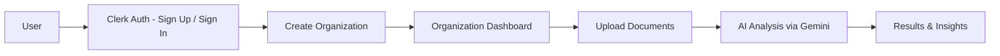
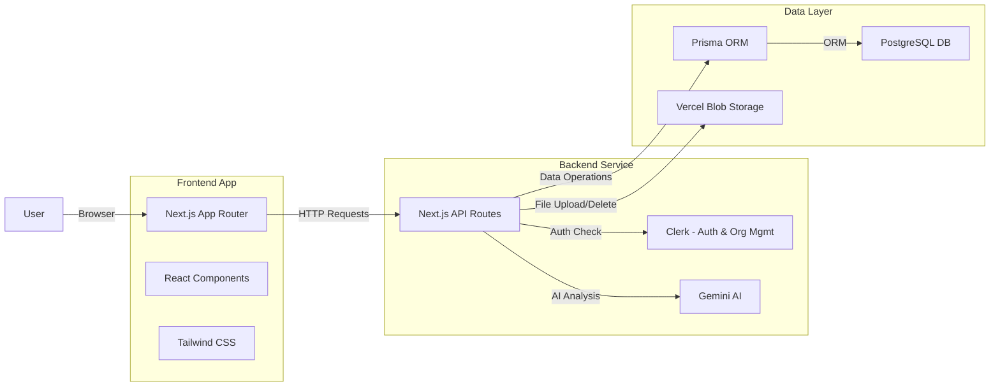

# DocuAI — Project Business Analysis

## What Is This Product?

**DocuAI** is a **multi-tenant SaaS platform** for AI-powered document analysis. In simple terms:

> A team signs up → creates an organization → uploads documents → gets instant AI-generated summaries, Q&A, sentiment analysis, and entity extraction — all powered by Google Gemini AI.

Think of it like a simplified **Google Drive + ChatGPT for documents**, scoped per organization.

---

## User Journey (from [User journey.png](file:///d:/1-Software/Results-Osama/tasks/saas-clerk-postgreSQL-geminiai/public/User%20journey.png))



| Step | What Happens |
|------|-------------|
| **1. Sign Up / Sign In** | User authenticates via Clerk (hosted auth UI) |
| **2. Create Organization** | User creates a team/company workspace |
| **3. Organization Dashboard** | User sees their org's documents |
| **4. Upload Documents** | User uploads files (stored in Vercel Blob) |
| **5. AI Analysis** | Backend sends document content to Gemini AI |
| **6. Results & Insights** | User sees AI summary, sentiment, Q&A, entities |

---

## Architecture (from [archeticture.png](file:///d:/1-Software/Results-Osama/tasks/saas-clerk-postgreSQL-geminiai/public/archeticture.png))



---

## Database Tables (from [tables.png](file:///d:/1-Software/Results-Osama/tasks/saas-clerk-postgreSQL-geminiai/public/tables.png))

Defined in [schema.prisma](file:///d:/1-Software/Results-Osama/tasks/saas-clerk-postgreSQL-geminiai/prisma/schema.prisma):

| Table | Purpose | Key Fields |
|-------|---------|------------|
| **Users** | Stores app users synced from Clerk | `clerkUserId`, `email`, `name` |
| **Organizations** | Company/team workspaces | `clerkOrgId`, `name`, `slug` |
| **OrganizationMembers** | Links users to orgs with roles | `userId`, `organizationId`, `role` |
| **Documents** | Uploaded files + AI analysis results | `name`, `content`, `fileURL`, `aiSummary`, `aiKeywords`, `sentiment` |

### Key Relationships
- A **User** can belong to many **Organizations** (through OrganizationMembers)
- An **Organization** has many **Documents**
- A **Document** belongs to one **Organization** and one **User** (uploader)

---

## Frontend vs Backend — Who Does What?

### 🖥️ Frontend (What the user sees & interacts with)

| Responsibility | Where in Code | Status |
|---------------|---------------|--------|
| **Landing page** — hero, features, CTA | [app/page.tsx](file:///d:/1-Software/Results-Osama/tasks/saas-clerk-postgreSQL-geminiai/app/page.tsx) | ✅ Done |
| **Auth pages** — sign-in / sign-up UI | [app/(auth)/](file:///d:/1-Software/Results-Osama/tasks/saas-clerk-postgreSQL-geminiai/app/(auth)) — uses Clerk components | ✅ Done |
| **Header** with nav & user button | [Header.tsx](file:///d:/1-Software/Results-Osama/tasks/saas-clerk-postgreSQL-geminiai/components/common/Header.tsx) | ✅ Done |
| **Footer** | [Footer.tsx](file:///d:/1-Software/Results-Osama/tasks/saas-clerk-postgreSQL-geminiai/components/common/Footer.tsx) | ✅ Done |
| **Organization dashboard** — list docs, upload UI, trigger analysis | [app/organizations/page.tsx](file:///d:/1-Software/Results-Osama/tasks/saas-clerk-postgreSQL-geminiai/app/organizations/page.tsx) | ⚠️ Skeleton only |
| **Document upload form** — file picker, drag & drop | *Not yet built* | ❌ Missing |
| **Document list view** — table/cards showing docs + AI results | *Not yet built* | ❌ Missing |
| **AI analysis trigger button** — pick analysis type, call API | *Not yet built* | ❌ Missing |
| **Results display** — show AI summary, sentiment, etc. | *Not yet built* | ❌ Missing |

**Frontend's job in short:**
1. Render pages and forms
2. Handle user interactions (clicks, file uploads, navigation)
3. Call backend API routes via `fetch()` or form actions
4. Display data returned from the backend

> [!IMPORTANT]
> The frontend should **never** directly access the database, Gemini AI, or Blob storage. It always goes through the API routes.

---

### ⚙️ Backend (API Routes — server-side logic)

| Responsibility | Where in Code | Status |
|---------------|---------------|--------|
| **Sync Clerk user to DB** on every page load | [lib/sync-user.ts](file:///d:/1-Software/Results-Osama/tasks/saas-clerk-postgreSQL-geminiai/lib/sync-user.ts) — called in [layout.tsx](file:///d:/1-Software/Results-Osama/tasks/saas-clerk-postgreSQL-geminiai/app/layout.tsx) | ✅ Done |
| **Create organization** — validate, save to DB, add owner membership | [api/organizations/route.ts](file:///d:/1-Software/Results-Osama/tasks/saas-clerk-postgreSQL-geminiai/app/api/organizations/route.ts) `POST` | ⚠️ Has bugs |
| **Upload document** — receive file, upload to Vercel Blob, save metadata to DB | [api/documents/route.ts](file:///d:/1-Software/Results-Osama/tasks/saas-clerk-postgreSQL-geminiai/app/api/documents/route.ts) | ❌ Empty file |
| **Delete document** — verify ownership, delete from Blob + DB | [api/documents/[documentId]/route.ts](file:///d:/1-Software/Results-Osama/tasks/saas-clerk-postgreSQL-geminiai/app/api/documents/%5BdocumentId%5D/route.ts) `DELETE` | ⚠️ Incomplete |
| **AI analysis** — auth check → find doc → call Gemini → save results | [api/analyze/route.ts](file:///d:/1-Software/Results-Osama/tasks/saas-clerk-postgreSQL-geminiai/app/api/analyze/route.ts) `POST` | ✅ Working |
| **Blob storage** — upload/delete files to Vercel Blob | [lib/blob.ts](file:///d:/1-Software/Results-Osama/tasks/saas-clerk-postgreSQL-geminiai/lib/blob.ts) | ✅ Done |
| **Gemini AI integration** — build prompts, call API | [lib/gemeni.ts](file:///d:/1-Software/Results-Osama/tasks/saas-clerk-postgreSQL-geminiai/lib/gemeni.ts) | ✅ Done |
| **Prisma client** — DB connection | [lib/prisma.ts](file:///d:/1-Software/Results-Osama/tasks/saas-clerk-postgreSQL-geminiai/lib/prisma.ts) | ✅ Done |

**Backend's job in short:**
1. **Authenticate** every request (via Clerk's `auth()`)
2. **Authorize** — verify user belongs to the organization
3. **Validate** incoming data
4. **Business logic** — create orgs, upload/delete files, run AI analysis
5. **Database operations** — CRUD via Prisma
6. **External services** — Gemini AI calls, Vercel Blob uploads
7. **Return JSON responses** to the frontend

> [!IMPORTANT]
> The backend handles **all** security, data validation, and external service calls. The frontend is just a "pretty client" that calls these APIs.

---

## The Data Flow for Each Feature

### 1. User Authentication
```
Frontend                          Backend
───────                          ───────
Clerk <SignIn/> component  →  Clerk handles auth externally
                              ↓
                           layout.tsx calls syncUserToDatabase()
                              ↓
                           Upserts user in PostgreSQL (via Prisma)
```

### 2. Create Organization
```
Frontend                          Backend
───────                          ───────
Form with org name         →  POST /api/organizations
                              ↓
                           Clerk auth() → validate body → check if exists
                              ↓
                           Create org in DB → add creator as "owner" member
                              ↓
                           Return JSON ← ← ← ← ← Display result
```

### 3. Upload Document
```
Frontend                          Backend
───────                          ───────
File picker / drag-drop    →  POST /api/documents  (FormData with file)
                              ↓
                           Auth → upload file to Vercel Blob → save metadata to DB
                              ↓
                           Return JSON ← ← ← ← ← Update document list
```

### 4. AI Analysis
```
Frontend                          Backend
───────                          ───────
Click "Analyze" button     →  POST /api/analyze  { documentId, organizationId, analysisType }
                              ↓
                           Auth → find doc → verify org membership
                              ↓
                           Send content to Gemini AI → get result
                              ↓
                           Save aiSummary to DB → Return JSON
                              ↓
                           ← ← ← ← ←  Display AI summary/results
```

---

## Current Status Summary

| Area | Status | Notes |
|------|--------|-------|
| Auth (Clerk) | ✅ Complete | Sign-in, sign-up, user sync all working |
| Landing Page | ✅ Complete | Hero, features, steps, CTA sections |
| Layout / Header / Footer | ✅ Complete | Shared layout with Clerk provider |
| Database Schema | ✅ Complete | All 4 tables defined and related |
| Prisma + PostgreSQL | ✅ Complete | Client configured with PG adapter |
| Vercel Blob helpers | ✅ Complete | Upload & delete functions ready |
| Gemini AI helpers | ✅ Complete | 5 analysis types supported |
| Create Organization API | ⚠️ Buggy | Has a logic bug on line 15 (`!name \|\| clerkOrgId` should be `!name \|\| !clerkOrgId`) |
| Upload Document API | ❌ Empty | `api/documents/route.ts` is empty |
| Delete Document API | ⚠️ Incomplete | Finds the doc but never actually deletes it |
| Analyze Document API | ✅ Complete | Auth → find → Gemini → save → respond |
| Org Dashboard Frontend | ⚠️ Skeleton | Just fetches orgs and logs to console |
| Document Upload UI | ❌ Missing | No upload form/component |
| Document List UI | ❌ Missing | No way to view documents |
| AI Results UI | ❌ Missing | No way to see analysis results |

> [!NOTE]
> **In summary:** The backend infrastructure (DB, auth, AI, blob storage) is mostly built. The major gaps are:
> 1. The **document upload API** (`POST /api/documents`)
> 2. The **document delete API** needs to be finished
> 3. All the **frontend UI pages** for the organization dashboard (document list, upload form, analysis results display)
