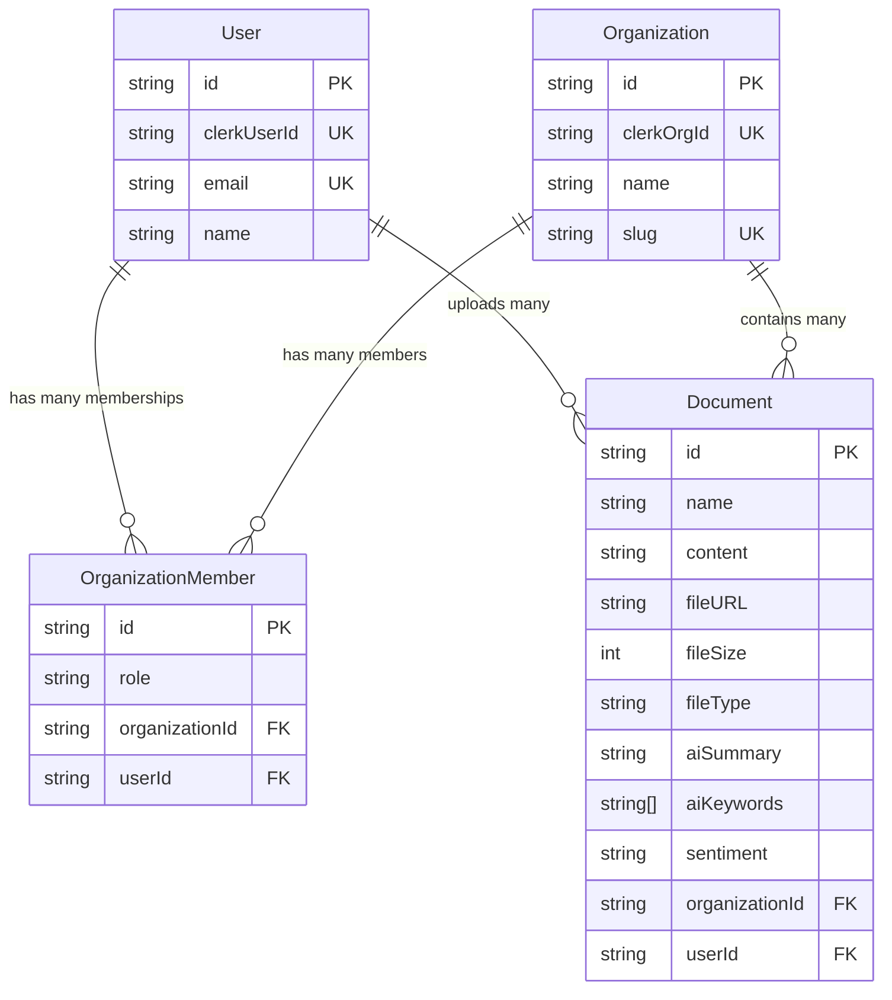

# DocuAI — Business Scenarios & Data Rules

## The 3 Storage Systems

Before diving into scenarios, understand that this app uses **3 separate places** to store data:

| Storage | What It Stores | Technology |
|---------|---------------|------------|
| **Clerk** (external service) | User accounts, passwords, sessions, organization metadata | Clerk cloud |
| **PostgreSQL** (database) | Users, organizations, memberships, document **records** (metadata + AI results) | PostgreSQL via Prisma ORM |
| **Vercel Blob** (file storage) | The actual **file bytes** (PDFs, images, etc.) | Vercel Blob cloud storage |

> [!IMPORTANT]
> **PostgreSQL does NOT store the actual file.** It only stores a `fileURL` that **points to** the file in Vercel Blob. Think of it like: PostgreSQL holds the "library catalog card", Vercel Blob holds the "actual book".

---

## Entity Relationships (The Business Rules)

### 🟢 Users

```
One User can belong to MANY Organizations  (through OrganizationMember)
One User can upload MANY Documents
```

**Scenario:**
> User "Ahmed" is a member of "Acme Corp" and "Beta LLC". He uploaded 5 documents to Acme Corp and 3 documents to Beta LLC.

In the database:
```
users table:
┌──────┬─────────────┬───────────────────┐
│ id   │ clerkUserId │ email             │
├──────┼─────────────┼───────────────────┤
│ u1   │ clerk_ahmed │ ahmed@email.com   │
└──────┴─────────────┴───────────────────┘

organization_members table:
┌──────┬────────────────┬────────┬───────┐
│ id   │ organizationId │ userId │ role  │
├──────┼────────────────┼────────┼───────┤
│ m1   │ org_acme       │ u1     │ owner │
│ m2   │ org_beta       │ u1     │ member│
└──────┴────────────────┴────────┴───────┘
```

---

### 🟢 Organizations

```
One Organization has MANY Members (users)
One Organization has MANY Documents
```

**Scenario:**
> "Acme Corp" has 3 members: Ahmed (owner), Sara (member), Khaled (member). The org has 10 documents total uploaded by various members.

```
organizations table:
┌──────────┬────────────┬───────────┐
│ id       │ clerkOrgId │ name      │
├──────────┼────────────┼───────────┤
│ org_acme │ clerk_acme │ Acme Corp │
└──────────┴────────────┴───────────┘

organization_members table:
┌──────┬────────────────┬────────┬────────┐
│ id   │ organizationId │ userId │ role   │
├──────┼────────────────┼────────┼────────┤
│ m1   │ org_acme       │ u1     │ owner  │
│ m2   │ org_acme       │ u2     │ member │
│ m3   │ org_acme       │ u3     │ member │
└──────┴────────────────┴────────┴────────┘
```

---

### 🟢 Documents

```
One Document belongs to exactly ONE Organization
One Document belongs to exactly ONE User (the uploader)
One Document has at most ONE AI analysis result (stored as fields on the same record)
```

**Scenario:**
> Ahmed uploaded "report.pdf" to Acme Corp. The actual PDF file is in Vercel Blob. PostgreSQL only has the metadata + the URL pointing to the blob.

```
documents table:
┌──────┬────────────┬──────────────────────────────┬────────────────┬────────┐
│ id   │ name       │ fileURL                      │ organizationId │ userId │
├──────┼────────────┼──────────────────────────────┼────────────────┼────────┤
│ d1   │ report.pdf │ https://blob.vercel/org-a... │ org_acme       │ u1     │
└──────┴────────────┴──────────────────────────────┴────────────────┴────────┘
```

---

## Complete Scenario Walkthroughs

---

### 📘 Scenario 1: User Signs Up

**What the user does:** Clicks "Sign Up", fills in email/password on the Clerk form.

**What happens step by step:**

```
Step 1: Clerk (external) creates the user account & session
           └─ Stored in: ☁️ Clerk cloud

Step 2: User lands on any page → layout.tsx runs syncUserToDatabase()
           └─ Reads user info from Clerk
           └─ Creates/updates a row in PostgreSQL "users" table

Step 3: Result in PostgreSQL:
           ┌─────────────────────────────────────────────┐
           │ users table                                 │
           │ id: "cuid123"                               │
           │ clerkUserId: "user_abc123"  (from Clerk)    │
           │ email: "ahmed@email.com"                    │
           │ name: "Ahmed Ali"                           │
           │ createdAt: 2026-07-13                       │
           └─────────────────────────────────────────────┘
```

> [!NOTE]
> The user exists in **two places**: Clerk (for auth) and PostgreSQL (for app data). The `clerkUserId` field links them together.

---

### 📘 Scenario 2: User Creates an Organization

**What the user does:** Fills in an org name and submits.

**What happens step by step:**

```
Step 1: Frontend sends POST /api/organizations
           body: { name: "Acme Corp", clerkOrgId: "org_xxx", slug: "acme-corp" }

Step 2: Backend checks auth (is user logged in?)
           └─ auth() → gets clerkUserId

Step 3: Backend checks if org already exists in DB
           └─ prisma.organization.findUnique({ where: { clerkOrgId } })

Step 4: Backend creates the organization row:
           ┌─────────────────────────────────────┐
           │ organizations table                 │
           │ id: "cuid456"                       │
           │ clerkOrgId: "org_xxx"               │
           │ name: "Acme Corp"                   │
           │ slug: "acme-corp"                   │
           └─────────────────────────────────────┘

Step 5: Backend creates a membership row (creator = owner):
           ┌─────────────────────────────────────┐
           │ organization_members table          │
           │ userId: "cuid123"  (Ahmed)          │
           │ organizationId: "cuid456" (Acme)    │
           │ role: "owner"                       │
           └─────────────────────────────────────┘

Step 6: Returns JSON → Frontend shows success
```

**Business rule:** The user who creates the org automatically becomes the **"owner"**.

---

### 📘 Scenario 3: User Uploads a Document

**What the user does:** Picks a file (e.g., `report.pdf`) and clicks Upload.

**What happens step by step:**

```
Step 1: Frontend sends POST /api/documents
           body: FormData containing the file + organizationId

Step 2: Backend checks auth
           └─ Is user logged in? Is user a member of this org?

Step 3: File goes to Vercel Blob:
           ┌──────────────────────────────────────────────────────────┐
           │ ☁️ Vercel Blob Storage                                  │
           │                                                          │
           │ Path: org-cuid456/users-cuid123/1689012345-report.pdf   │
           │ URL:  https://xyz.blob.vercel-storage.com/org-cuid456/  │
           │       users-cuid123/1689012345-report.pdf               │
           │                                                          │
           │ 📄 ← The actual PDF bytes live HERE                     │
           └──────────────────────────────────────────────────────────┘

Step 4: Metadata saved to PostgreSQL:
           ┌─────────────────────────────────────────────────┐
           │ documents table                                 │
           │ id: "cuid789"                                   │
           │ name: "report.pdf"                              │
           │ content: null  (or extracted text if available)  │
           │ fileURL: "https://xyz.blob.vercel-storage..."   │ ← points to Blob
           │ fileSize: 204800                                │
           │ fileType: "application/pdf"                     │
           │ aiSummary: null          (not analyzed yet)     │
           │ aiKeywords: []           (not analyzed yet)     │
           │ sentiment: null          (not analyzed yet)     │
           │ organizationId: "cuid456"  (Acme Corp)         │
           │ userId: "cuid123"          (Ahmed)              │
           └─────────────────────────────────────────────────┘
```

> [!IMPORTANT]
> **Two things are stored in two places:**
> - **Vercel Blob** → the actual file (PDF bytes)
> - **PostgreSQL** → the record/metadata (name, URL pointer, size, who uploaded it, which org)
>
> PostgreSQL does **NOT** hold the file. It holds a **URL** that points to where the file lives in Blob storage.

---

### 📘 Scenario 4: User Triggers AI Analysis

**What the user does:** Clicks "Analyze" on a document and picks an analysis type (e.g., "summary").

**What happens step by step:**

```
Step 1: Frontend sends POST /api/analyze
           body: { documentId: "cuid789", organizationId: "org_xxx", analysisType: "summary" }

Step 2: Backend checks auth
           └─ Is user logged in?

Step 3: Backend finds the document AND verifies org membership:
           └─ "Does document cuid789 belong to an org where this user is a member?"
           └─ This is the AUTHORIZATION check (not just auth)

Step 4: Backend reads the document's content field
           └─ Uses document.content (text) or document.name as fallback

Step 5: Backend calls Gemini AI:
           ┌──────────────────────────────────────────────┐
           │ ☁️ Google Gemini AI                          │
           │                                              │
           │ Prompt: "Make a summary for this text: ..."  │
           │ Response: "This report covers..."            │
           └──────────────────────────────────────────────┘

Step 6: Backend UPDATES the document record in PostgreSQL:
           ┌─────────────────────────────────────────────────┐
           │ documents table (UPDATED)                       │
           │ id: "cuid789"                                   │
           │ name: "report.pdf"                              │
           │ aiSummary: "This report covers quarterly..."   │ ← NEW
           │ aiKeywords: ["analyzed"]                        │ ← NEW
           │ sentiment: "summary"                            │ ← NEW
           │ ... (rest unchanged)                            │
           └─────────────────────────────────────────────────┘

Step 7: Returns JSON with summary → Frontend displays it
```

> [!NOTE]
> The AI result is saved **back into the same document row** in PostgreSQL. There's no separate "analysis" table. The document record doubles as both the file metadata AND the analysis results container.

---

### 📘 Scenario 5: User Deletes a Document

**What the user does:** Clicks "Delete" on a document.

**What should happen step by step:**

```
Step 1: Frontend sends DELETE /api/documents/cuid789

Step 2: Backend checks auth

Step 3: Backend finds the document and verifies the user is an org member

Step 4: Backend deletes the file from Vercel Blob:
           └─ deleteFromBlob(fileURL) → removes the actual PDF

Step 5: Backend deletes the record from PostgreSQL:
           └─ prisma.document.delete({ where: { id: "cuid789" } })

Step 6: Returns success → Frontend removes it from the list
```

> [!WARNING]
> **Currently, Step 4 and 5 are NOT implemented.** The delete API route finds the document but never actually deletes anything. See [route.ts](file:///d:/1-Software/Results-Osama/tasks/saas-clerk-postgreSQL-geminiai/app/api/documents/%5BdocumentId%5D/route.ts).

---

## Multi-Tenancy Rules (Organization Isolation)

This is a **multi-tenant** app. Each organization is isolated:

```
┌──────────────────────────────────┐   ┌──────────────────────────────────┐
│  Acme Corp (org)                 │   │  Beta LLC (org)                  │
│                                  │   │                                  │
│  Members: Ahmed, Sara, Khaled    │   │  Members: Ahmed, Omar            │
│                                  │   │                                  │
│  Documents:                      │   │  Documents:                      │
│   📄 report.pdf (by Ahmed)       │   │   📄 contract.pdf (by Ahmed)     │
│   📄 invoice.pdf (by Sara)       │   │   📄 notes.txt (by Omar)         │
│   📄 plan.docx (by Khaled)       │   │                                  │
│                                  │   │                                  │
│  ❌ Omar CANNOT see these        │   │  ❌ Sara, Khaled CANNOT see these│
└──────────────────────────────────┘   └──────────────────────────────────┘
```

| Rule | Explanation |
|------|-------------|
| 🟢 A user can be in **multiple** organizations | Ahmed is in both Acme and Beta |
| 🟢 A document belongs to **exactly one** organization | report.pdf is ONLY in Acme Corp |
| 🟢 A document is uploaded by **exactly one** user | report.pdf was uploaded by Ahmed |
| 🟢 **All members** of an org can see that org's documents | Sara can see Ahmed's report.pdf (same org) |
| 🔴 A user **cannot** see another org's documents | Omar cannot see Acme's report.pdf |
| 🟢 Any org member can **trigger AI analysis** on any doc in that org | Sara can analyze Ahmed's report.pdf |
| 🟢 AI results are saved on the **document itself** | The summary is stored in the `aiSummary` column of that document |

---

## Data Ownership Summary



### Where each piece of data lives:

| Data | Clerk | PostgreSQL | Vercel Blob |
|------|:-----:|:----------:|:-----------:|
| User password & session | ✅ | ❌ | ❌ |
| User profile (name, email) | ✅ | ✅ (copy) | ❌ |
| Organization metadata | ✅ | ✅ (copy) | ❌ |
| Who belongs to which org | ❌ | ✅ | ❌ |
| Document record (name, size, type) | ❌ | ✅ | ❌ |
| Document file URL (pointer) | ❌ | ✅ | ❌ |
| Actual file bytes (PDF, image...) | ❌ | ❌ | ✅ |
| AI analysis results | ❌ | ✅ | ❌ |

---

## Blob Storage File Path Convention

When a file is uploaded, it's stored in Vercel Blob with this path pattern:

```
org-{organizationId}/users-{userId}/{timestamp}-{filename}
```

**Example:**
```
org-cuid456/users-cuid123/1689012345678-quarterly-report.pdf
     │              │           │              │
     │              │           │              └─ original filename (spaces → dashes)
     │              │           └─ timestamp (ensures uniqueness)
     │              └─ who uploaded it
     └─ which organization
```

This structure means:
- Files are organized by **org first**, then by **user**
- You can easily find all files for an org, or all files by a user within an org
- Timestamps prevent name collisions (two files named "report.pdf" won't overwrite each other)
